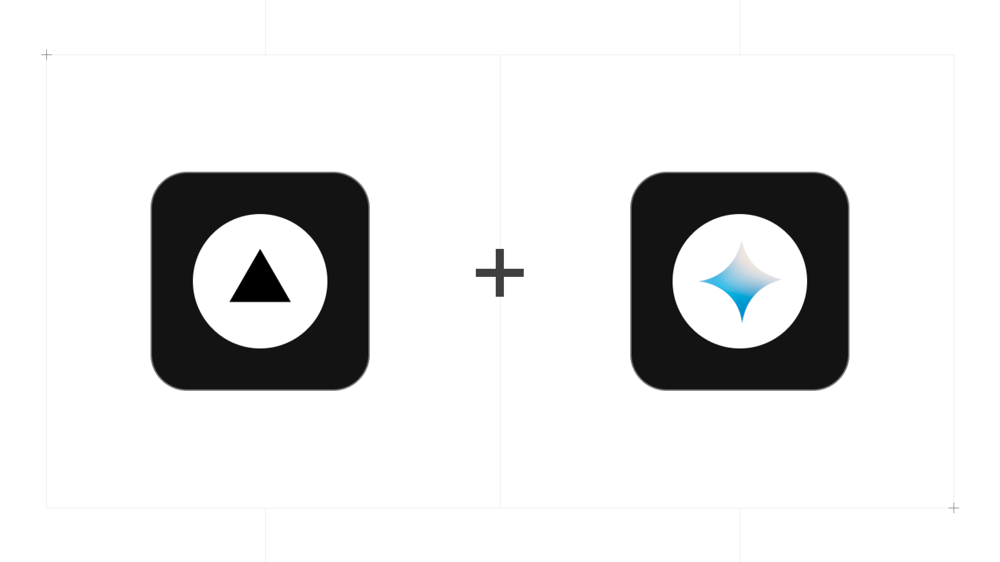

<a href="https://github.com/Md-Zainulabdin/Bot">
  
  <br>
  <br>
  <h1>Bot | Modern AI Chatbot</h1>
</a>

<p>
  A full-featured, customizable AI chatbot template powered by the Google Gemini model, built with Next.js, and styled with TailwindCSS and Shadcn UI.
</p>

<p>
  <a href="#features"><strong>Features</strong></a> ·
  <a href="#model-provider"><strong>Model Provider</strong></a> ·
  <a href="#deploy-your-own"><strong>Deploy Your Own</strong></a> ·
  <a href="#running-locally"><strong>Running Locally</strong></a>
</p>

## Features

- **[Next.js](https://nextjs.org)** for seamless routing and optimized server-side rendering
  - Advanced React Server Components for performance and modular code
- **[Vercel AI SDK](https://sdk.vercel.ai/docs)** for enhanced AI capabilities
  - Unified APIs to integrate the Google Gemini model and other providers
  - Simplified hooks to build dynamic and interactive AI chat features
- **[shadcn/ui](https://ui.shadcn.com)** for a polished UI
  - TailwindCSS integration for custom styling
  - Radix UI component primitives for accessibility
- **React Syntax Highlighter** for code snippet display with syntax highlighting
- **Google Gemini Model** for state-of-the-art AI-driven interactions

## Model Provider

This chatbot is powered by the **Google Gemini model** using the [Vercel AI SDK](https://sdk.vercel.ai/docs). It allows easy customization to switch between models like OpenAI, Anthropic, Cohere, and others with minimal configuration.

## Deploy Your Own

Deploy your own chatbot on Vercel with one click:

[](https://vercel.com/new/clone?repository-url=https%3A%2F%2Fgithub.com%2Fyour-username%2Fmodern-ai-chatbot&env=API_KEY,MODEL_PROVIDER&envDescription=Add%20your%20Google%20Gemini%20or%20other%20API%20Key%20here.&envLink=https%3A%2F%2Fdocs.your-chatbot-app.com%2Fenv&demo-title=Modern%20AI%20Chatbot&demo-description=A%20customizable%20AI%20chatbot%20template%20powered%20by%20the%20Google%20Gemini%20model%20and%20built%20with%20Next.js%20and%20TailwindCSS.&demo-url=https%3A%2F%2Fyour-chatbot-app.com&stores=[])

## Running Locally

To run the chatbot locally, follow these steps:

1. Clone this repository:

   ```bash
   git clone https://github.com/Md-Zainulabdin/Bot.git
   ```

2. Create a <code>.env</code> ile in the root directory and add the necessary environment variables:

   ```bash
   GOOGLE_GENERATIVE_AI_API_KEY=""
   ```

3. Install dependencies:

   ```bash
   npm install
   ```

4. Start the development server

   ```bash
   npm run dev
   ```

Your chatbot should now be running at localhost:3000.
